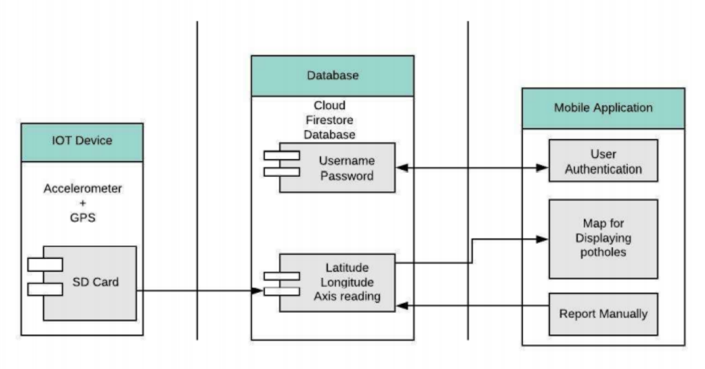
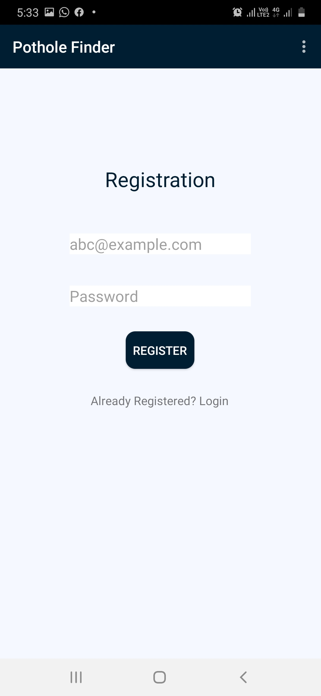
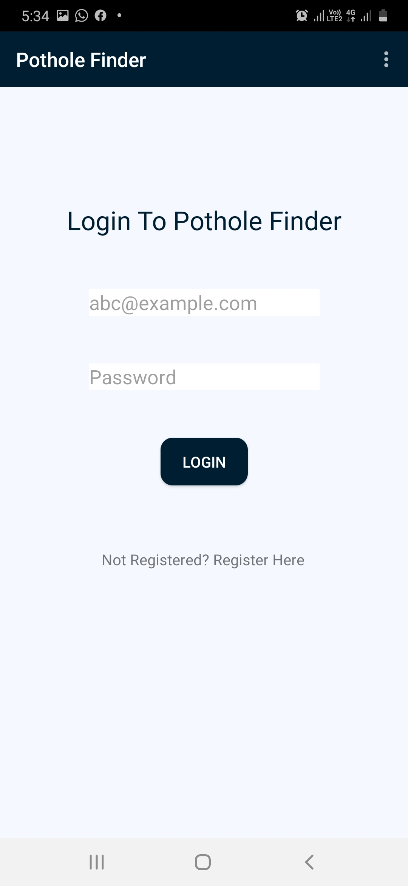
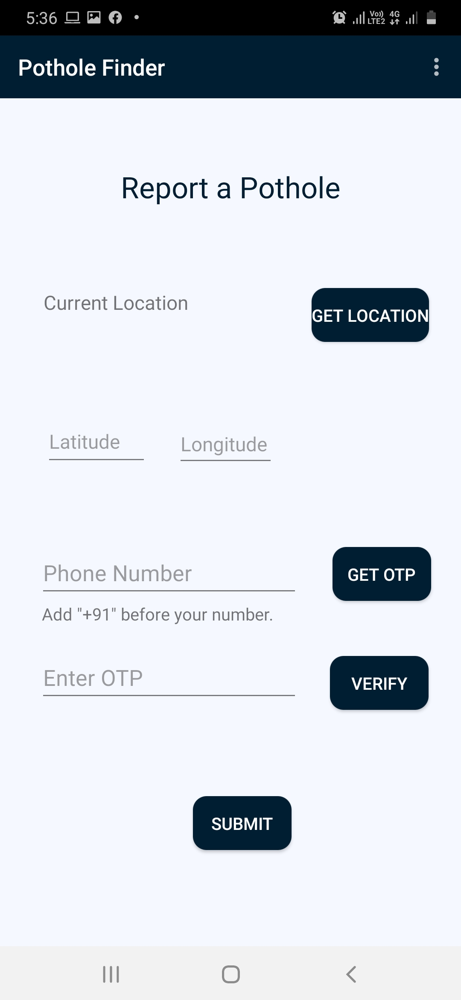

# Pothole-Finder 
The objective is to make transparency to people about the solution or ongoing work on potholes in the their travel route. This project is focused on getting data from a cloud where it is accessed via a mobile application which will help to track and monitor the condition of the roads. It will help reduce accidents as well as to provide a safe and comfortable route to the user.

# Architecture

# Installing

1. Download Andoid Studio 
2. Download all project files in one folder
3. Open folder using Android Studio
4. Run the Application

# How to use the app

1. Register yourself as valid user, using Email ID.

2. Then Login using those credentials.

3. Now you can access the Map 

4. Also you can report a pothole mannually by filling a form.
   You can access the form from menu at top right corner, Click on "Report a Pothole" and form will open.
 

# Details
DBIT 
BE Project  
Team 23  
IT

# Participants
Shreya Ghute  
Srushti Satardekar  
Xavier Dsouza  

